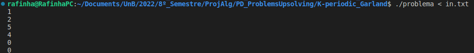
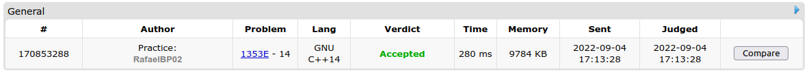
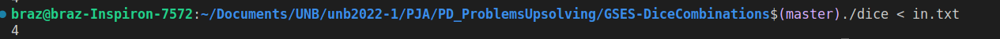
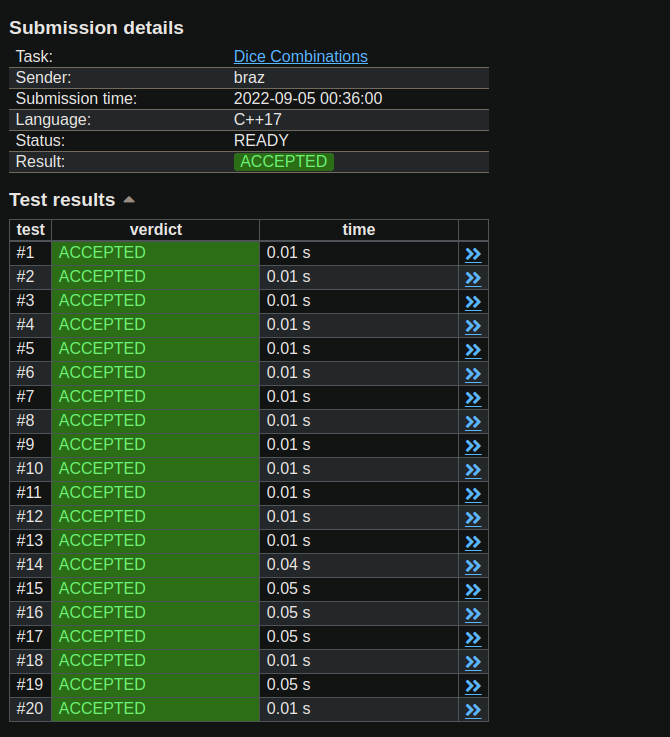
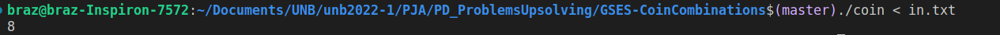
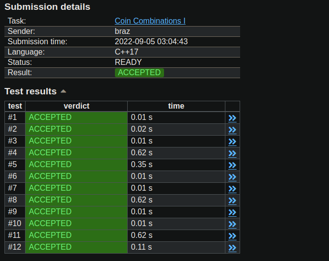

#  PD_ProblemsUpsolving


**Conteúdo da Disciplina**: DP<br>

## Alunos
|Matrícula | Aluno | Usuario Codeforces
| -- | -- | -- |
| 18/0018159  |  Guilherme Veríssimo Cerveira Braz | braz
| 18/0108344  |  Rafael Berto Pereira | RafaelBP02

## Sobre 
Iremos resolver algumas questões de progamação dinâmica do Codeforces, um site de questões de programação para competição. O trabalho será dividido em pastas onde cada uma contém a resolução da questão em C++, o binario, e um caso de teste in.txt

## Vídeo
O Video está salvo na pasta video
## Screenshots

### Qestão K-periodic Garland
Enunciado: https://codeforces.com/contest/1353/problem/E

No Terminal:


Link do Accepted: https://codeforces.com/contest/1353/submission/170853288


### Questao Dice Combinations
Enunciado: https://cses.fi/problemset/task/1633

No Terminal:


Link do Accepted: link não é público


### Questao Coin Combinations I
Enunciado: https://cses.fi/problemset/task/1635

No Terminal:


Link do Accepted: link não é público

## Instalação 
**Linguagem**: C++, Python3<br>
**Framework**: N/A<br>

## Uso 
abra o terminal dentro da pasta da respectiva questão e rode

### C++
```
g++ -o questao (nome da solução).C 
```
```
./questao < in.txt
```
### Python
```
python3 (nome da solução).py < teste
```
## Outros 
N/A
